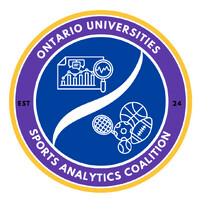

## Speaking Engagements

::: {.grid .align-items-center}

::: {.g-col-12 .g-col-md-4 .text-center}
{width="80%" .border .rounded}
:::

::: {.g-col-12 .g-col-md-8}
### OUSAC
**“Predicting the Puck With Pythagoras”**

At the 2025 Ontario Universities Sports Analytics Conference I spoke on my work with predicting NHL season long wins using the pythagorean win expectations formula.

[Watch the Full Talk →](https://youtu.be/2P5KwVbfm78?si=MEXoyv7pgO8JBe5M)
:::

:::

::: {.grid .align-items-center}

::: {.g-col-12 .g-col-md-4 .text-center}
{width="80%" .border .rounded}
:::

::: {.g-col-12 .g-col-md-8}
### MSU Simon Lecture

At the 2025 MSU Simon Lecture presented by the Actuarial Sciences department I delivered a short technical lecture on the applications of the implied random variable to sports.

[Read the Lecture Recap →](https://actuarialscience.natsci.msu.edu/simonlecture/simon-lecture-2025/SimonLecture25.aspx)
:::

:::

## Featured Interviews

::: {.grid .align-items-center}

::: {.g-col-12 .g-col-md-4 .text-center}
{width="60%" .border .rounded}
:::

::: {.g-col-12 .g-col-md-8}
### FOX 47: Predicting the Rivalry
**“MSU Students use math and statistics to predict the winner of Friday's matchup with the Wolverines”**

I sat down with Fox 47 to discuss using the **Pythagorean Expectation** (the "Moneyball formula") to analyze the MSU vs. Michigan basketball matchup.

[Watch the Full Interview →](https://www.fox47news.com/neighborhoods/msu-campus/watch-msu-students-use-math-to-predict-the-winner-of-fridays-matchup-with-the-wolverines)
:::

:::

::: {.grid .align-items-center}

::: {.g-col-12 .g-col-md-4 .text-center}
{width="80%" .border .rounded}
:::

::: {.g-col-12 .g-col-md-8}
### The Drive with Jack
**"Albert Cohen & Joey Larabee discuss analytics in sports"**

In this appearance on *The Drive with Jack*, I joined the show with my mentor Albert Cohen to discuss the growing and changing role of analytics in sports.

[Listen to the Show →](https://archive.fm/broadcast/20454687)
:::

:::
